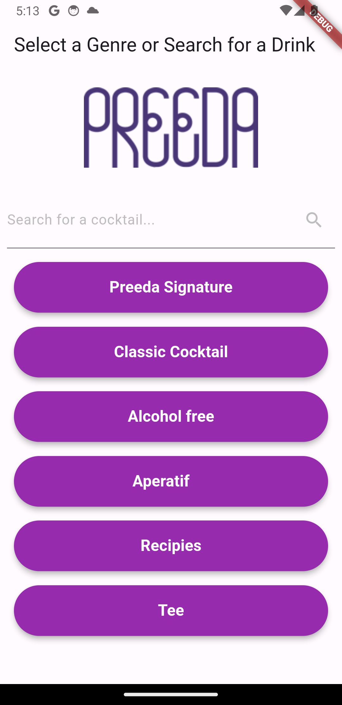

# Preeda Cocktails App

**Preeda Cocktails** is a Flutter-based mobile application that fetches cocktail data from a Google Sheets API and displays it in a user-friendly interface. Users can search for cocktails by name or ingredients, browse by genre, and view detailed information about each drink. This Project was created in hopes of helping the New Bartenders of Preeda learn and keep the recipes on hand.

## Features

- Search cocktails by name or ingredients.
- Browse cocktails by genre.
- View detailed information including ingredients, instructions, garnish, price, and more.
- Smooth and interactive UI with images, search functionality, and genre-based filtering.

## Screenshots

Here are some screenshots of the app:


_Home Screen with genre and search functionality_


_Genre selection screen_


_Search cocktails by ingredients or name_


_Detailed view of a selected cocktail_

## Getting Started

### Prerequisites

To run this project locally, you need to have the following:

- Flutter SDK (v2.0 or above)
- Android Studio or Xcode (for mobile development)
- A Google API Key with access to Google Sheets
- Your own Sheets file, organized as such: (Name, Glass, Main Ingredient, Photo, Ingredients, Instructions, Garnish, Price, Genre)

### Installation

1. **Clone the repository:**

   ```bash
   git clone
   cd preeda-cocktails
   ```

2. **Install Flutter dependencies:**
   Make sure you have Flutter installed and set up. Then run:

   ```bash
   flutter pub get
   ```

3. **Configure the API Key:**

   - Replace the `apiKey` variable with your own Google Sheets API key:
     ```dart
     final String apiKey = 'YOUR_GOOGLE_API_KEY';
     ```

4. **Run the App:**
   You can now run the app using Flutter:
   ```bash
   flutter run
   ```

### Google Sheets API Setup

To fetch cocktail data from Google Sheets, you'll need to set up Google Sheets API access and get an API key. Here’s how:

1. Go to the [Google Developers Console](https://console.developers.google.com/).
2. Create a new project.
3. Enable the **Google Sheets API** for your project.
4. Create credentials for an API Key.
5. Copy the API key and replace it in the code (`apiKey` variable in `HomeScreen`).

Make sure that your Google Sheet is public or shared appropriately, or you have set up the correct OAuth scopes.

### Project Structure

The key files in this project are organized as follows:

```
PREEDA_COCKTAIL_APP/
├── .dart_tool/                # Dart tool-related files
├── .idea/                     # Project settings for JetBrains IDEs
├── .vscode/                   # VSCode settings
├── android/                   # Android-specific files
├── build/                     # Generated build files
├── ios/                       # iOS-specific files
├── lib/
│   ├── images/                # Contains image assets used in the app
│   │   ├── Favicon.png
│   │   └── Preeda_Restaurant_Berlin_Logo_200.png
│   └── main.dart              # Main entry point for the Flutter app
├── linux/                     # Linux-specific files
├── macos/                     # macOS-specific files
├── Screenshots/               # Screenshots used in the README
│   ├── Home_Screen.png
│   ├── Genre_List.png
│   ├── Search_Function.png
│   └── Cocktail_Details.png
├── test/
│   └── widget_test.dart        # Unit and widget tests
├── web/                       # Web-specific files
├── windows/                   # Windows-specific files
├── .gitignore                 # Files and directories to be ignored by Git
├── analysis_options.yaml       # Dart analysis options
├── preeda_cocktail_app.iml     # IntelliJ project file
├── pubspec.yaml               # Defines the dependencies for the project
├── pubspec.lock               # Version-locked dependency file
└── README.md                  # The README file you're reading now
```

## Usage

Once the app is up and running, you can:

- **Search** for cocktails by typing into the search bar.
- **Browse genres** by selecting from the list of genres.
- **Tap** on any cocktail to view its details, including ingredients, instructions, and more.

## Contributing

Contributions are welcome! If you’d like to add features, improve the code, or fix bugs, feel free to submit a pull request. Please make sure to discuss major changes in an issue first.

## Acknowledgments

- [Flutter](https://flutter.dev/) - The framework used to build this app.
- [Google Sheets API](https://developers.google.com/sheets/api) - For fetching cocktail data.
